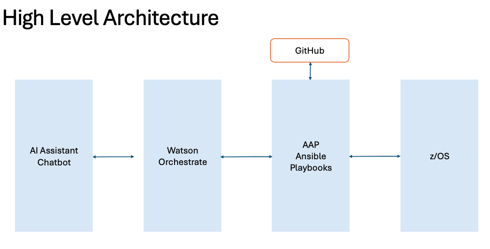

# wxa4z-hackathon Skill Assets  

We utilize and update the [software_management](./zos_concepts/software_management/README.md) ansible playbooks to automate the PTF installation process on z/OS.  

## File structure  

- **`zos_concepts/software_management`** – Contains PTF install ansible playbooks for z/OS, which is later imported as wxa4z skills 
- **`exported_skills/`** – Exported file from Watson Assistant on Z Skills Studio.  
- **`exported_actions/`** – Exported file  from Watson Assistant on Z Actions.  

## High level architecture
